# 🔬 Scientific Paper Classifier

An AI-powered application that automatically classifies scientific papers into medical categories using advanced language models and retrieval-augmented generation (RAG).


## 📋 Table of Contents

- [Overview](#overview)
- [Features](#features)
- [Architecture](#architecture)
- [Categories](#categories)
- [Installation](#installation)
- [Configuration](#configuration)
- [Usage](#usage)
- [API Documentation](#api-documentation)
- [Project Structure](#project-structure)
- [Technologies](#technologies)
- [Contributing](#contributing)
- [License](#license)

## 🎯 Overview

The Scientific Paper Classifier is a comprehensive AI system designed to categorize biomedical research papers into specific medical domains. The system combines the power of Large Language Models (LLMs) with vector databases and web search capabilities to provide accurate, contextual classifications with detailed explanations.

### Key Components

- **Backend API**: FastAPI-based service with intelligent agent classification
- **Frontend Interface**: Modern Streamlit web application
- **AI Agent**: LangChain/LangGraph agent with multiple tools
- **Vector Database**: Supabase with embedding-based retrieval
- **Web Search**: Tavily integration for real-time research

## ✨ Features

### 🤖 Intelligent Classification
- Multi-modal AI agent using OpenAI GPT models
- Vector similarity search for context-aware classification
- Real-time web search for current medical research
- Confidence scoring and detailed rationale

### 🎨 Modern Interface
- Clean, professional Streamlit frontend
- Category-specific color coding and icons
- Real-time API status monitoring
- Interactive examples and guidance

### 🔧 Robust Architecture
- RESTful API with FastAPI
- Asynchronous processing for scalability
- Comprehensive error handling
- Modular, maintainable codebase

## 🏗️ Architecture

```mermaid
graph TB
    A[User Interface<br/>Streamlit] --> B[FastAPI Backend]
    B --> C[Agent Service]
    C --> D[OpenAI LLM]
    C --> E[Vector Database<br/>Supabase]
    C --> F[Web Search<br/>Tavily]
    E --> G[Embedding Model<br/>OpenAI]
    
    subgraph "Tools"
        E
        F
    end
    
    subgraph "AI Stack"
        D
        G
        H[LangChain/LangGraph]
    end
    
    C --> H
```



## 🏥 Categories

The system classifies papers into four main medical categories:

| Category | Icon | Description | Color |
|----------|------|-------------|-------|
| **Cardiovascular** | ❤️ | Heart, blood vessels, circulatory system | Red |
| **Neurological** | 🧠 | Brain, nervous system, neurological disorders | Green |
| **Hepatorenal** | 🫀 | Liver, kidney, hepatic and renal systems | Orange |
| **Oncological** | 🎗️ | Cancer, tumors, oncology research | Purple |

## 🚀 Installation

### Prerequisites

- Python 3.8+
- OpenAI API key
- Supabase account and database
- Tavily API key

### Backend Setup

1. **Clone the repository**
   ```bash
   git clone https://github.com/CarlosYazid/scientific-paper-classifier.git
   cd scientific-paper-classifier
   ```

2. **Install backend dependencies**
   ```bash
   cd backend
   pip install -r requirements.txt
   ```

3. **Configure environment variables**
   ```bash
   cp .env.example .env
   # Edit .env with your API keys and configuration
   ```

4. **Run the FastAPI server**
   ```bash
   cd src
   uvicorn main:app --reload --host 0.0.0.0 --port 8000
   ```

### Frontend Setup

1. **Install frontend dependencies**
   ```bash
   cd frontend
   pip install -r requirements.txt
   ```

2. **Run the Streamlit application**
   ```bash
   streamlit run app.py --server.port 8501
   ```

3. **Access the application**
   - Frontend: http://localhost:8501
   - API Docs: http://localhost:8000/docs

## ⚙️ Configuration

### Environment Variables

Create a `.env` file in the backend directory:

```env
# Database Configuration
DATABASE_URL=your_supabase_url
DATABASE_KEY=your_supabase_anon_key
MAX_RESULT_RAG=10
EMBEDDING_MODEL=text-embedding-3-small
THRESHOLD=0.7

# OpenAI Configuration
OPENAI_API_KEY=your_openai_api_key
MODEL=gpt-4o-mini

# Tavily Configuration
TAVILY_API_KEY=your_tavily_api_key
MAX_RESULT_TAVILY=5
```

### Database Setup

The system requires a Supabase database with:
- Vector embeddings table for paper storage
- `match_documents` function for similarity search
- Proper indexing for performance

## 📖 Usage

### Web Interface

1. **Access the Streamlit app** at http://localhost:8501
2. **Enter paper details**:
   - Title: Complete paper title
   - Abstract: Full abstract text
3. **Click "Classify Paper"** to get results
4. **Review the output**:
   - Category classification
   - Confidence score (0-1)
   - Detailed rationale

### API Usage

```python
import requests

# Classification endpoint
url = "http://localhost:8000/classify/"
data = {
    "title": "Effects of ACE inhibitors on cardiovascular outcomes",
    "abstract": "Background: Heart failure remains a leading cause..."
}

response = requests.post(url, json=data)
result = response.json()

print(f"Category: {result['category']}")
print(f"Confidence: {result['confidence']:.2%}")
print(f"Rationale: {result['rationale']}")
```

## 📚 API Documentation

### Endpoints

#### `POST /classify/`

Classifies a scientific paper into medical categories.

**Request Body:**
```json
{
  "title": "string",
  "abstract": "string"
}
```

**Response:**
```json
{
  "category": "Cardiovascular|Neurological|Hepatorenal|Oncological",
  "confidence": 0.95,
  "rationale": "Detailed explanation of the classification decision"
}
```

#### `GET /`

Health check endpoint.

**Response:**
```json
{
  "status": "Ok"
}
```

## 📁 Project Structure

```
scientific-paper-classifier/
├── backend/
│   ├── src/
│   │   ├── core/
│   │   │   ├── __init__.py
│   │   │   └── settings.py
│   │   ├── db/
│   │   │   ├── __init__.py
│   │   │   └── main.py
│   │   ├── models/
│   │   │   ├── __init__.py
│   │   │   └── agent.py
│   │   ├── routes/
│   │   │   ├── __init__.py
│   │   │   └── agent.py
│   │   ├── services/
│   │   │   ├── __init__.py
│   │   │   └── agent.py
│   │   └── main.py
│   └── requirements.txt
├── frontend/
│   ├── app.py
│   ├── requirements.txt
│   └── run.sh
├── .gitignore
├── LICENSE
└── README.md
```

## 🛠️ Technologies

### Backend
- **FastAPI**: Modern, fast web framework
- **LangChain/LangGraph**: AI agent framework
- **OpenAI**: Language model and embeddings
- **Supabase**: Vector database and storage
- **Tavily**: Web search API
- **Pydantic**: Data validation and settings

### Frontend
- **Streamlit**: Interactive web applications
- **Requests**: HTTP client for API calls

## 🤝 Contributing

1. Fork the repository
2. Create a feature branch (`git checkout -b feature/amazing-feature`)
3. Commit your changes (`git commit -m 'Add amazing feature'`)
4. Push to the branch (`git push origin feature/amazing-feature`)
5. Open a Pull Request

### Contribution Guidelines

- Follow PEP 8 style guidelines
- Write comprehensive tests
- Update documentation
- Ensure backward compatibility

## 📋 Roadmap

- [ ] **Multi-language support** for international papers
- [ ] **Batch processing** for multiple papers
- [ ] **Advanced analytics** and reporting dashboard
- [ ] **Custom category** training and fine-tuning
- [ ] **Integration APIs** for research platforms
- [ ] **Performance optimization** and caching

## 🐛 Known Issues

- Large abstracts may take longer to process
- Rate limiting on API calls may affect performance
- Vector database requires proper indexing for optimal speed

## 📄 License

This project is licensed under the Apache License 2.0 - see the [LICENSE](LICENSE) file for details.

## 🙋‍♂️ Support

For support and questions:

- **Issues**: GitHub Issues
- **Discussions**: GitHub Discussions
- **Email**: [contact@carlospadilla.co]

## 🙏 Acknowledgments

- **OpenAI** for providing the language models
- **LangChain** for the agent framework
- **Supabase** for the vector database
- **Streamlit** for the user interface framework
- **FastAPI** for the backend framework

---

**⭐ If you find this project helpful, please consider giving it a star!**